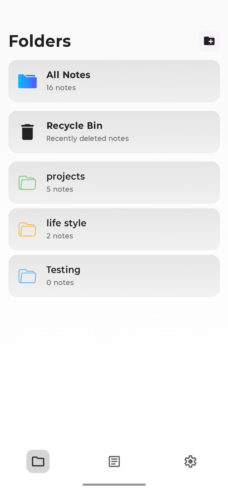
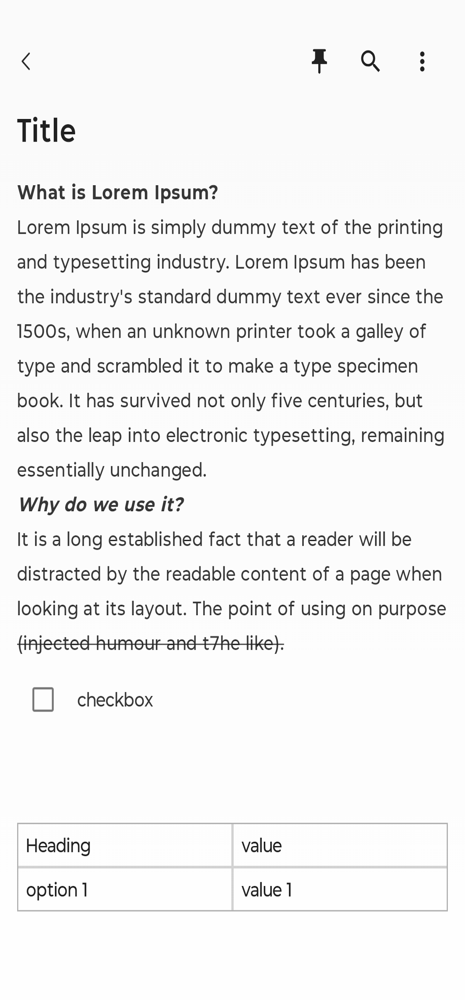
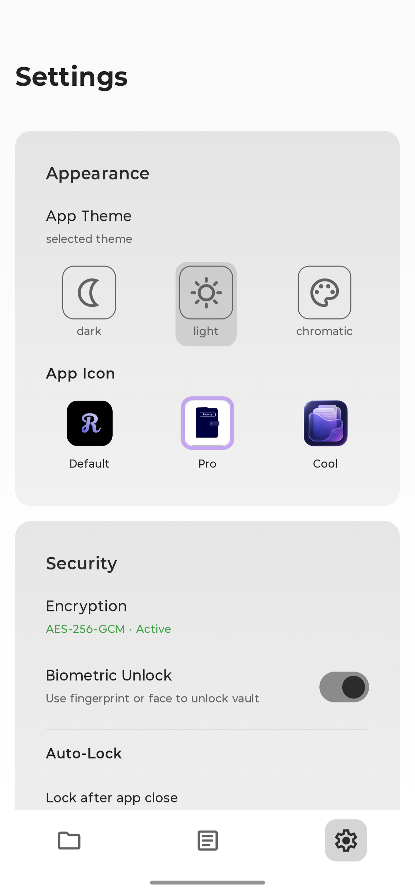

# Records

**Records** is a privacy-first, local-first, block-based rich text note-taking application for Android. Built entirely in Kotlin using **Jetpack Compose**, **Material 3**, and the **Room Database**, Records blends a desktop-class note editor with a sophisticated, dual-layer cryptographic vault designed to keep your personal data completely private and secure.

---

## Key Features

### 📝 Block-Based Rich Text Editor
Unlike traditional note apps that limit you to flat plain text, Records features a flexible block-based content layout:
- **Rich Text Blocks:** Create highly structured notes with multi-style HTML formatting (bold, italics, headers, links).
- **Interactive Checklists:** Track tasks directly inside your notes with inline checklist blocks.
- **Dynamic Tables:** Structure tabular data with customizable rows, columns, and editable cells.
- **Granular History Control:** A dedicated `UndoRedoManager` groups rapid keystrokes with debounced state saving and forces immediate history snapshots on structural changes.

### 🛡️ Dual-Layer Cryptographic Vault
Your notes are encrypted at the field level before being committed to disk:
- **Zero-Knowledge Architecture:** Cryptographic keys are derived locally and never leave the device.
- **Dual-Layer Key Management:** Master keys are derived via **PBKDF2-HMAC-SHA256** (with 600,000 iterations), wrapped with an hardware-backed **Android Keystore AES-GCM** key, and persisted in **EncryptedSharedPreferences**.
- **HMAC Blind Indexing:** Fully supports fast full-text searching over encrypted databases using space-delimited truncated HMAC search indexes.
- **Automated Lifecycle Protection:** Instantly locks the session on application backgrounding or when the screen turns off.

### 🎨 Personalization & UX
- **Beautiful Material 3 Themes:** Choose from multiple built-in color schemes, including Records Light/Dark, Proton Dark, and true black **Proton AMOLED**.
- **Dynamic App Icons:** Dynamically customize your home screen appearance by choosing between Default, Pro, and Cool app launcher icons.
- **Biometric Authentication:** Lock and unlock your vault effortlessly with Fingerprint or Face unlock via the Android Biometric API.
- **Recycle Bin:** Safeguard your data with a soft-delete trash container that tracks deletion timestamps for recovery or permanent removal.

---

## Cryptographic Architecture

Records is designed to secure user notes even on compromised or physically stolen devices. Below is a breakdown of the dual-layer key derivation and storage flow:

```
[ User Password ] 
       │
       ▼
[ PBKDF2-HMAC-SHA256 ] ────► [ 256-bit Master Key ]
 (600,000 Iterations)               │
                                    ├──► [ AES-256-GCM Encryption ] ──► Encrypted Note Title & Content
                                    │
                                    ▼
                      [ Android Keystore AES Wrap ]
                                    │
                                    ▼
                      [ EncryptedSharedPreferences ]
```

### 1. Key Derivation & Storage (KeyManager)
* **Master Key Derivation:** When you set a password, a cryptographically secure random 32-byte salt is generated. A 256-bit AES master key is derived using PBKDF2 with HMAC-SHA256 and `600,000` iterations to resist brute-force attacks.
* **Keystore Wrapping:** The master key is encrypted (wrapped) with a hardware-backed AES-GCM wrapper key generated inside the `AndroidKeyStore` provider.
* **Storage:** The wrapped master key, IV, and KDF salt are stored inside `EncryptedSharedPreferences`, which uses AES-256-SIV for keys and AES-256-GCM for values.

### 2. Field-Level Encryption (EncryptionManager)
Every time a note is created or updated:
* A fresh, random 12-byte Initialization Vector (IV) is generated via `SecureRandom`.
* The note's Title and Content blocks are encrypted using **AES-256-GCM** with a 128-bit authentication tag.
* The resulting data is stored in the Room database in the format: `Base64(IV [12 bytes] || Ciphertext || AuthTag [16 bytes])`.

### 3. Blind Search Indexing (SecureSearchIndexer)
To allow search queries on encrypted fields without leaking the raw database contents to memory or indexing in plaintext:
* **Tokenization:** Note contents are tokenized into lowercase alphanumeric words.
* **HMAC-SHA256 Generation:** A deterministic search key is derived from the Master Key via HMAC-SHA256 (`records-search-index-key`).
* **Truncation:** Each token is hashed with the search key, and the resulting hash is truncated to `8 bytes` to conserve storage space while minimizing collision probability.
* **Matching:** The truncated Base64 hashes are joined into a space-delimited string and saved in the `searchIndex` column. Search queries are converted into matching hashes to query the index directly.

---

## Tech Stack & Dependencies

- **Language:** Kotlin
- **UI Framework:** Jetpack Compose (Material 3 components, Icons Extended)
- **Navigation:** Jetpack Compose Navigation
- **Database:** Room (SQLite abstraction layer with Kotlin Coroutines & KSP)
- **Encryption:** `androidx.security:security-crypto` & standard Java Cryptography Architecture (JCA)
- **Auth:** AndroidX Biometric library
- **Rich Editor:** `richeditor-compose` by Mohamed Rejeb
- **JSON Serialization:** Google Gson

---
## Screenshots

<p align="center">
  
  
  
</p>

---

## Project Structure

```
app/src/main/java/com/example/records/
├── database/            # Room entities (Note, Folder), DAOs, and Database setup
├── repository/          # Repository layer handling note/folder data transactions
├── security/            # EncryptionManager, KeyManager, and Blind Indexer
├── ui/
│   ├── components/      # Reusable UI elements (Block Editor, bottom sheet)
│   ├── navigation/      # Screen route definitions and AppNavHost
│   ├── screen/          # Full screen composables (NotesList, Folders, Settings, Unlock)
│   └── theme/           # Color palettes, typography configurations, and RecordsTheme
└── util/                # AppIconManager, Biometrics, and other system utility scripts
```

---

## Build & Run Instructions

### Prerequisites
* JDK 17
* Android Studio (Koala or newer recommended)
* Android SDK (Compile target API 35, Minimum API 24)

### Clone & Build
1. Clone this repository to your local machine:
   ```bash
   git clone https://github.com/your-username/Records.git
   ```
2. Open the project in Android Studio.
3. Sync the project with Gradle files.
4. Run the app on your physical device or emulator using the run configuration:
   ```bash
   ./gradlew assembleDebug
   ```

---

## Contributing

We welcome contributions of all kinds! If you would like to submit bug reports, feature requests, or code updates:
1. Fork the repository.
2. Create a feature branch: `git checkout -b feature/amazing-feature`.
3. Commit your changes: `git commit -m 'Add some amazing feature'`.
4. Push to the branch: `git push origin feature/amazing-feature`.
5. Open a Pull Request.

---

## License

This project is licensed under the Apache License 2.0. See the `LICENSE` file for details.
